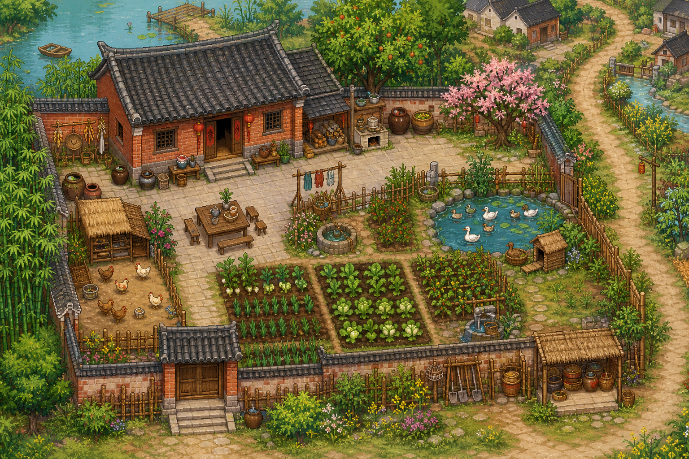
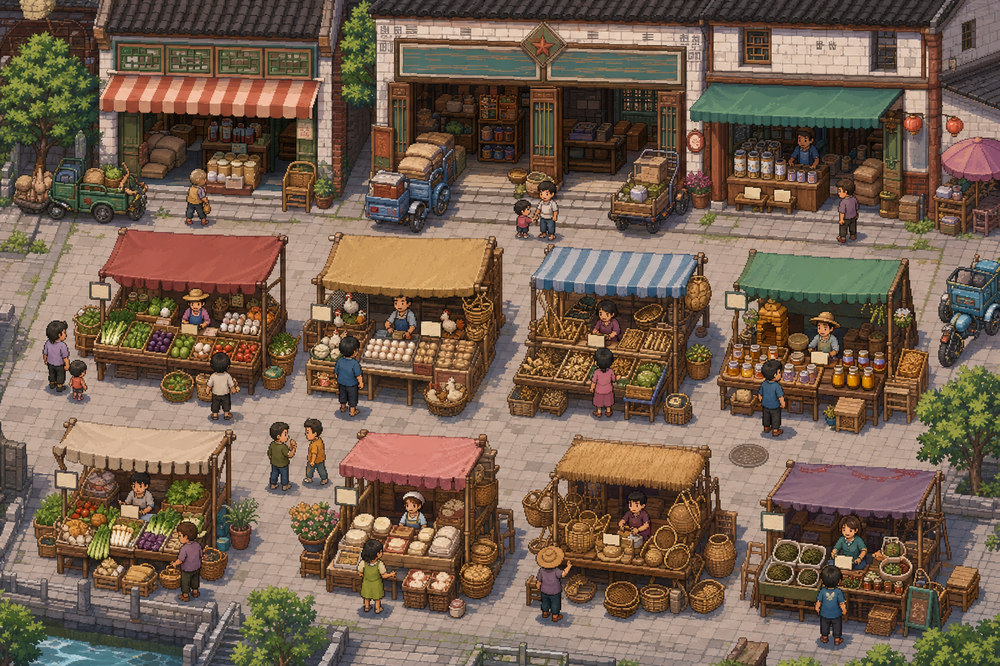
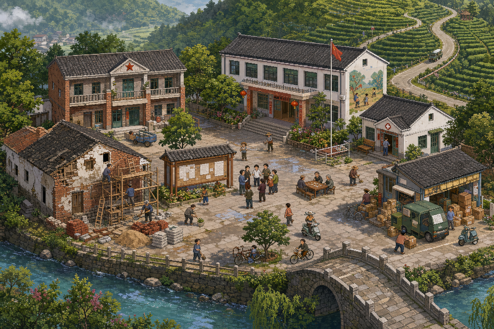
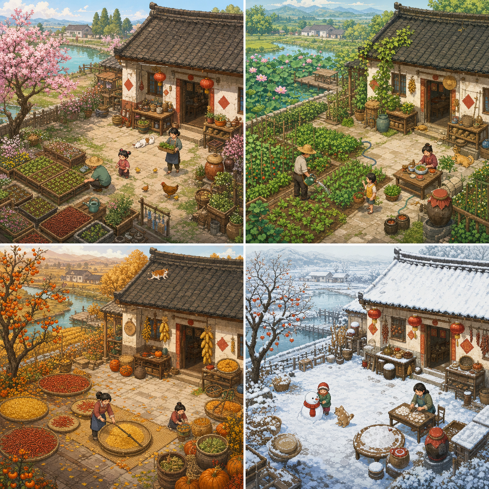
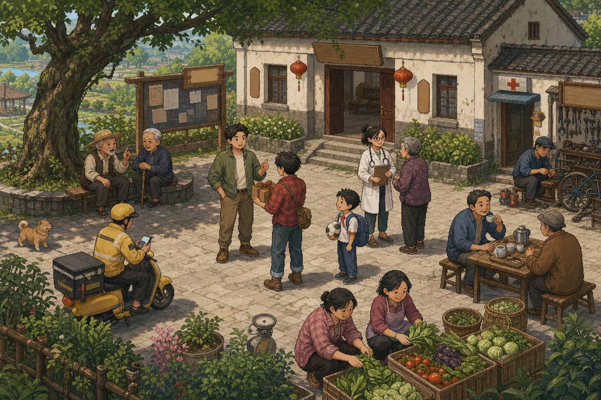
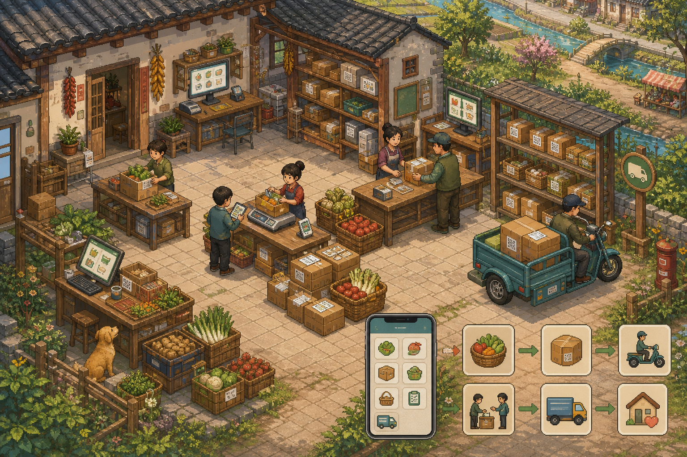
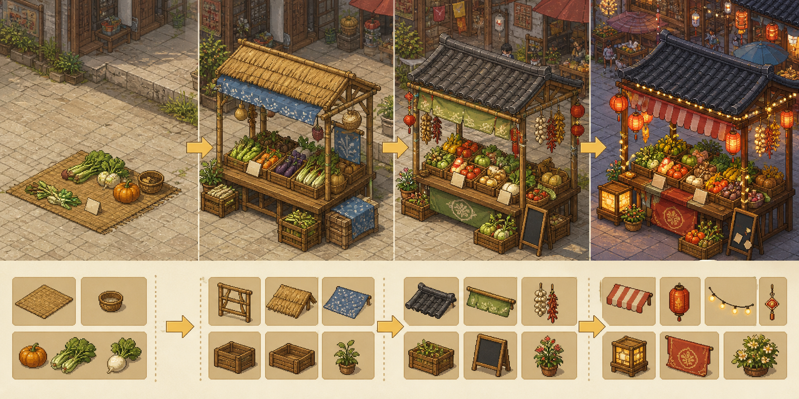
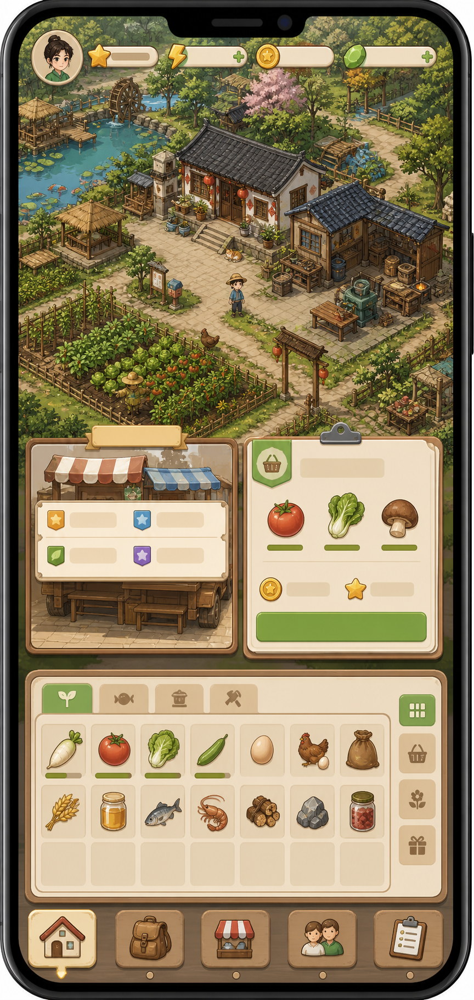
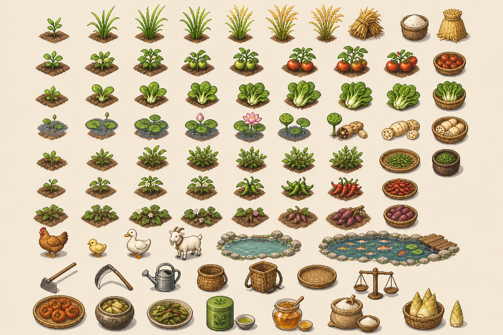

# 小满村概念图索引

本文件用于留存当前微信小游戏玩法模块的第一版视觉方向。图片由 `imagegen` 生成，定位为概念参考，不是最终生产素材。

## 玩法模块概念图

### 小院经营

用途：主基地、小院布局、种植、养殖、鱼塘、工具和村路关系参考。

### 县城集市

用途：多人赶集、摆摊交易、好友摊位、NPC 顾客和县城老街氛围参考。

### 农产品加工坊

用途：晒干、腌制、蒸煮、制茶、磨粉、包装等加工玩法空间参考。

### 村庄建设

用途：村委会、供销社、快递驿站、卫生室、老小学、桥梁和公共设施升级参考。

### 夜市/庙会/年集

用途：节日活动、夜市小游戏、庙会戏台、年货摊和限时活动氛围参考。

## 新增玩法模块概念图

### 世界地图总览

用途：规划小满村、县城老街、茶山、竹林、河道、稻田、快递驿站和玩家小院之间的空间关系。

### 四季变化

用途：定义春耕、夏种、秋收、冬藏的季节氛围，以及同一小院在不同节气下的活动变化。

### 村民社交

用途：规划 NPC 关系、村民任务、礼物互动、村医、快递员、返乡青年、老人和儿童等角色群像。

### 室内生活

用途：规划玩家家屋、厨房、卧室、储物、订单查看、装饰和日常恢复体力等室内功能。

### 河滩竹林探索

用途：规划钓鱼、采集、竹笋、草药、蜂箱、茶山路径和季节性隐藏资源。

### 快递电商

用途：规划农产品分拣、称重、打包、发货、好友订单、电商任务和快递驿站经营。

### 摊位升级

用途：规划从地摊、竹木摊、品牌摊到节庆夜市摊的成长线，以及摊位装饰和展示道具拆分。

### 手机端 UI 概念

用途：规划微信小游戏横屏界面、侧边/边角导航、背包、订单、集市入口、资源栏和触控信息密度（注：该概念图为早期竖屏 mockup，横版需重新出 UI 草图）。

### 作物与道具资产

用途：规划作物生长阶段、家禽鱼塘、农具、竹篮、秤、加工品和土特产图标的美术拆分方向。

## 覆盖范围

当前概念图已经覆盖：

- 玩家主基地：小院、室内、加工坊。
- 生产系统：种植、养殖、作物生长、工具、加工品。
- 交易系统：县城集市、摊位升级、夜市、庙会、年集、快递电商。
- 社交系统：村民群像、好友摊位、异步交易、订单协作。
- 探索系统：河滩、竹林、茶山、鱼塘、采集点。
- 长期运营：四季变化、节日活动、世界地图扩展。

## 生产注意事项

- 当前图片是视觉概念稿，后续正式美术应重新绘制可拆分、可复用的瓦片、角色、建筑和 UI 资产。
- 图中如有类似招牌或纸张的伪文字，正式版本需要替换为可控的原创中文字体或无文字图标。
- 不应直接借用其他游戏素材，应保持中国乡村、县城集市和微信社交玩法的原创辨识度。
