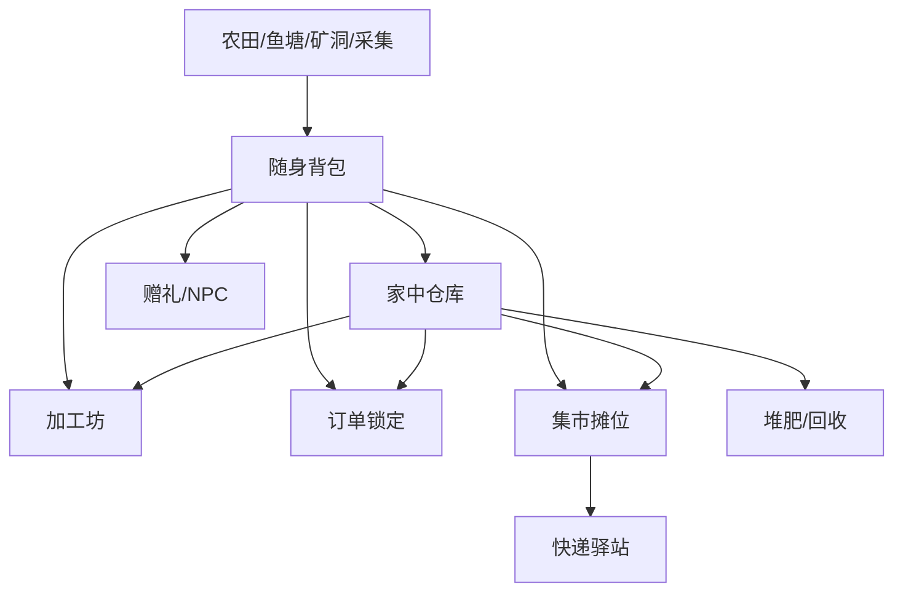

# 背包、仓库与物流设计

## 设计目标

背包和仓库决定经营游戏的日常顺滑度。系统要让玩家感到整理和备货有策略，但不能让分类、过期、订单和物流变成负担。

## 物品流转总览

## 随身背包

| 等级 | 格数 | 解锁 | 成本 | 设计目的 |
| ---: | ---: | --- | ---: | --- |
| 1 | 18 | 初始 | 0 | 支撑新手半天活动 |
| 2 | 24 | 供销社 | 500 | 支撑钓鱼和采集 |
| 3 | 32 | 供销社升级 | 1500 | 支撑挖矿 |
| 4 | 40 | 县城老街 | 4000 | 支撑集市备货 |
| 5 | 48 | 后期任务 | 9000 | 深度探索 |

## 仓库

| 仓库 | 容量 | 分类 | 解锁 | 说明 |
| --- | ---: | --- | --- | --- |
| 木箱 | 40 | 通用 | 初始 | 小院基础储物 |
| 粮仓 | 80 | 作物/粮食 | 修复晒谷场 | 大量存放作物 |
| 冷柜 | 60 | 生鲜/水产 | 快递驿站升级 | 延长保鲜 |
| 材料棚 | 100 | 木材/矿物/建材 | 木匠铺 | 建造材料 |
| 礼盒柜 | 50 | 加工品/礼盒 | 包装台 | 集市备货 |
| 剧情柜 | 不限 | 剧情物品 | 家屋升级 | 防止误售 |

## 物品堆叠规则

| 物品类型 | 默认堆叠 | 备注 |
| --- | ---: | --- |
| 种子 | 99 | 同品质堆叠 |
| 普通作物 | 99 | 不同品质分堆 |
| 高品质作物 | 50 | 良品、精品、珍品分开 |
| 水产 | 30 | 大小记录单独进图鉴，不占堆叠 |
| 矿物 | 99 | 适合批量消耗 |
| 加工品 | 50 | 保鲜期一致才堆叠 |
| 礼盒 | 20 | 包装类型不同分堆 |
| 家具 | 1 | 可进入家具仓库 |
| 剧情物品 | 1 | 不可出售 |

## 保鲜系统

| 类型 | 默认保鲜 | 过期后 | 延长方式 |
| --- | ---: | --- | --- |
| 叶菜 | 3 天 | 低价菜叶/堆肥 | 冷柜 +3 天 |
| 根茎 | 7 天 | 低品质作物 | 地窖 +5 天 |
| 水果 | 5 天 | 过熟水果 | 冷柜 +4 天 |
| 水产 | 2 天 | 不可出售，可做肥料 | 冷柜 +3 天 |
| 干货 | 60 天 | 无或品质下降 | 密封罐 |
| 腌制品 | 30 天 | 品质下降 | 陶罐 |
| 礼盒 | 15 天 | 拆回部分材料 | 礼盒柜 |

## 保鲜设计边界

- 新手前 7 天不应因为过期惩罚玩家。
- 过期提示提前一天出现。
- 关键任务物品和剧情物品不过期。
- 过期不是直接消失，应转为堆肥、低价材料或可回收资源。
- 保鲜系统主要服务备货策略，不制造焦虑。

## 订单锁定

订单需要支持锁定物品，避免玩家误卖。

| 状态 | 说明 |
| --- | --- |
| 未锁定 | 玩家仍可自由使用物品 |
| 手动锁定 | 玩家选择保留给订单 |
| 自动锁定 | 接取限时订单时默认锁定 |
| 可替换 | 同类同品质或更高品质可替换 |
| 过期释放 | 订单过期后自动返回可用库存 |

## 集市备货

| 功能 | 说明 |
| --- | --- |
| 一键补货 | 按上次集市配置补充库存 |
| 按主题筛选 | 夜市、年集、丰收集显示推荐商品 |
| 滞销提醒 | 上次未卖完商品显示原因 |
| 高价值确认 | 珍品、剧情物品、稀有鱼上架二次确认 |
| 价格批量设置 | 支持按建议价、促销价、高价策略 |

## 快递物流

| 功能 | 用途 | 解锁 |
| --- | --- | --- |
| 普通发货 | 完成 NPC 和系统订单 | 快递驿站 |
| 好友订单 | 给好友提交指定商品 | 微信好友 |
| 次日达 | 高价值订单，奖励更高 | 驿站等级 2 |
| 冷链箱 | 生鲜水产不掉品质 | 冷柜解锁 |
| 礼盒寄送 | 土特产礼盒订单 | 包装台 |
| 退货处理 | 超时或品质不符 | 电商支线 |

## 物流时间

| 方式 | 时间 | 成本 | 适用 |
| --- | --- | ---: | --- |
| 自取 | 即时 | 0 | 村民订单 |
| 普通快递 | 次日 | 5% 手续费 | 常规订单 |
| 加急件 | 4 小时 | 12% 手续费 | 限时订单 |
| 冷链件 | 次日 | 15% 手续费 | 水产、生鲜 |
| 年集批量车 | 当日结算 | 固定费用 | 大批礼盒 |

## 背包 UI 要求

- 支持按分类、品质、保鲜期、可出售、可加工、可任务提交筛选。
- 长按物品显示来源、用途、喜好 NPC、可加工配方。
- 任务物品和锁定物品有明显角标。
- 背包满时给出就近处理建议，例如放入仓库、出售、丢进堆肥。
- 从订单、加工、集市入口打开背包时自动筛选可用物品。

## 风险与验收

| 风险 | 应对 |
| --- | --- |
| 背包过早满导致挫败 | 前期容量够用，村口可快速回家 |
| 保鲜造成焦虑 | 新手保护期，过期转资源 |
| 玩家误卖任务物 | 锁定和二次确认 |
| 集市备货操作繁琐 | 一键补货和主题筛选 |
| 好友交易刷资源 | 服务端校验和每日限制 |
