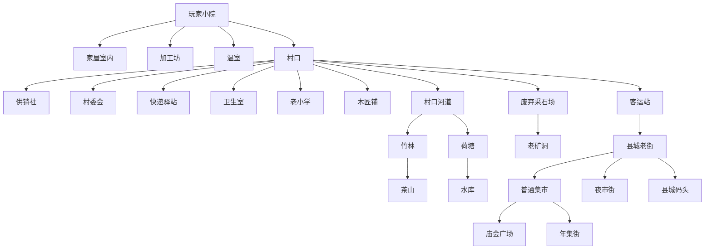

# 地图拓扑图和地图解锁表

## 地图设计原则

每张地图至少承担一个明确功能：生产、交易、社交、探索、剧情或节日活动。地图解锁应跟主线、村庄建设、NPC 好感和工具升级绑定。

## 拓扑概览

## MVP 地图

| map_id | 地图 | 区域 | 功能 | 解锁条件 | 关键 NPC |
| --- | --- | --- | --- | --- | --- |
| map_home_yard | 老院室外 | 小院 | 种植、养殖、鱼塘入口 | 初始 | 外婆 |
| map_home_house | 家屋室内 | 小院 | 睡觉、烹饪、储物 | 初始 | 外婆 |
| map_village_gate | 村口 | 村庄 | 交通、公告、初始社交 | 初始 | 赵春兰、余向前 |
| map_supply_store | 供销社 | 村庄 | 种子、工具、日用品 | 新手任务 2 | 赵春兰 |
| map_river | 村口河道 | 自然 | 钓鱼、采集 | 新手任务 3 | 韩伯 |
| map_courier | 快递驿站 | 村庄 | 订单、好友发货 | 主线第一周 | 梁建国 |
| map_county_market | 县城集市 | 县城 | 摆摊、购买 | 第一次收成 | 唐晓满 |
| map_workshop | 加工坊 | 小院 | 晒干、腌制、包装 | 修复杂物间 | 周木匠 |

## 完整地图解锁表

| map_id | 地图 | 类型 | 解锁条件 | 核心功能 | 美术变体 |
| --- | --- | --- | --- | --- | --- |
| map_home_yard | 老院室外 | 基地 | 初始 | 种植、养殖、装饰 | 四季、节日 |
| map_home_house | 家屋室内 | 室内 | 初始 | 睡觉、烹饪、储物 | 修缮等级 |
| map_home_workshop | 加工坊 | 室内 | 修复杂物间 | 加工、包装 | 设备等级 |
| map_home_greenhouse | 温室 | 基地 | 主线第 5 章 | 反季种植 | 四季 |
| map_home_orchard | 后院果树区 | 基地 | 清理后院 | 果树、蜂箱 | 花期、结果期 |
| map_village_gate | 村口 | 枢纽 | 初始 | 交通、公告 | 日夜、节日 |
| map_supply_store | 供销社 | 商店 | 新手任务 | 种子、工具 | 升级前后 |
| map_committee | 村委会 | 公共 | 主线第 1 章 | 村庄建设 | 公告更新 |
| map_courier | 快递驿站 | 功能 | 第一批收成 | 电商、好友订单 | 升级前后 |
| map_clinic | 卫生室 | 功能 | 体力透支或村医任务 | 恢复、草药 | 普通 |
| map_school | 老小学 | 公共 | 许老师支线 | 活动中心、课程 | 修复前后 |
| map_carpenter | 木匠铺 | 商店 | 认识周木匠 | 建筑、家具 | 普通 |
| map_repair_shop | 修理铺 | 商店 | 郭小满支线 | 机器维护 | 普通 |
| map_river | 村口河道 | 自然 | 初始 | 钓鱼、散步 | 晴雨夜 |
| map_bamboo | 竹林 | 自然 | 铜斧或村民带路 | 竹笋、竹材、溪流 | 雨后 |
| map_teahill | 茶山 | 自然 | 陈青山支线 | 茶叶、山货 | 采茶季 |
| map_lotus_pond | 荷塘 | 自然 | 修复河堤 | 莲藕、河虾 | 夏季 |
| map_reservoir | 水库 | 自然 | 水库路修复 | 高级钓鱼 | 晨昏夜 |
| map_wild_slope | 荒坡 | 自然 | 村庄声望 3 | 果树、蜂箱扩展 | 四季 |
| map_quarry | 废弃采石场 | 矿区 | 林书记任务 | 石材、黏土 | 普通 |
| map_old_mine | 老矿洞 | 矿区 | 采石场 20 层 | 铜铁矿 | 层级 |
| map_deep_mine | 老矿洞深层 | 矿区 | 铁镐 | 银矿、旧物 | 层级 |
| map_brick_kiln | 旧砖瓦窑 | 旧工业 | 周木匠好感 3 | 黏土、老砖 | 普通 |
| map_county_street | 县城老街 | 县城 | 客运站开放 | 商店、剧情 | 日夜 |
| map_county_market | 普通集市 | 县城 | 第一次赶集 | 摆摊 | 普通/节日 |
| map_night_market | 夜市街 | 县城 | 夏季或夜市任务 | 小吃、小游戏 | 夜晚 |
| map_farmers_market | 农贸市场 | 县城 | 摊位等级 3 | 批发、订单 | 普通 |
| map_county_pier | 县城码头 | 县城 | 县城老街升级 | 特殊鱼、物流 | 雾天 |
| map_bus_station | 客运站 | 交通 | 主线第 3 章 | 县城往返 | 普通 |
| map_temple_square | 庙会广场 | 活动 | 庙会开放 | 戏台、手作摊 | 节日 |
| map_year_market | 年集街 | 活动 | 冬季 21 日后 | 年货交易 | 春节 |
| map_harvest_yard | 丰收晒场 | 活动 | 秋季丰收集 | 作物评比 | 秋季 |

## 地图解锁节奏

| 阶段 | 解锁地图 | 目标 |
| --- | --- | --- |
| 第 1 天 | 小院、家屋、村口 | 明确玩家身份和基本移动 |
| 第 2 到 3 天 | 供销社、河道 | 种子购买和钓鱼教学 |
| 第 4 到 7 天 | 加工坊、快递驿站 | 第一次加工和订单 |
| 第 8 到 14 天 | 县城集市、村委会 | 第一次赶集和村庄建设 |
| 春季中段 | 竹林、采石场、木匠铺 | 材料循环和地图扩展 |
| 春季末 | 客运站、县城老街 | 县城生活和更大交易 |
| 夏季 | 荷塘、夜市街、水库 | 夏季特色玩法 |
| 秋季 | 丰收晒场、农贸市场 | 丰收集和批发 |
| 冬季 | 年集街、庙会广场 | 年货和春节活动 |

## 地图内容检查表

每张地图制作前需要确认：

- 是否有核心玩法入口。
- 是否有 1 到 3 名常驻或高频 NPC。
- 是否有季节变化需求。
- 是否有白天和夜晚变化需求。
- 是否有可采集、可交互或可任务触发对象。
- 是否需要和好友或集市系统产生关系。
