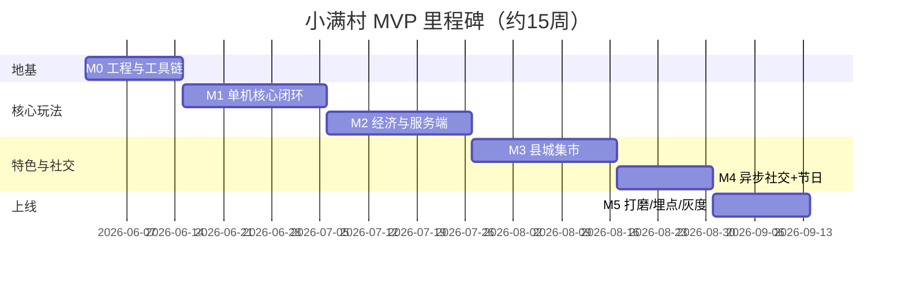

# 《小满村》MVP 研发里程碑与人力估算

## 文档定位

把 `design.md` 的 MVP 目标和 `onboarding-and-retention.md` 的前 7 天体验，拆成可执行的研发里程碑、交付物、验收标准与人力估算。配合 `tech-stack-recommendation.md` 的技术栈落地。

## MVP 目标回顾

验证核心闭环：**种田 → 加工 → 县城赶集 → 好友购买**，并跑通「前 10 分钟体验」和「前 7 天留存节奏」。

MVP 内容规模（来自 `design.md`）：

| 类型 | 数量 |
| --- | ---: |
| 可玩地图 | 6–8 张 |
| NPC | 10–15 名 |
| 作物 | 12–18 种 |
| 鱼类 | 12–20 种 |
| 矿物材料 | 10–15 种 |
| 加工品 | 20–30 种 |
| 剧情任务 | 20–30 条 |
| 台词 | 800–1200 句 |
| 节日活动 | 2–3 个 |

## 团队配置假设

人力估算基于以下小团队（可按实际增减）：

| 角色 | 人数 | 说明 |
| --- | ---: | --- |
| 主程（客户端） | 1 | Cocos + 架构 + 核心系统 |
| 客户端程序 | 1 | UI、系统、联调 |
| 服务端程序 | 1 | 存档、经济校验、社交 |
| 策划 | 1 | 配表、数值、任务、台词 |
| 美术 | 1–2 | 像素场景、UI、角色、动画 |
| 制作人/QA | 1（兼） | 排期、验收、测试 |

> 估算单位为「人天」（1 人全职 1 天）。并行进行，下表「日历周」按上述团队并行后的自然时间。

## 里程碑总览

| 里程碑 | 名称 | 日历周 | 核心目标 |
| --- | --- | ---: | --- |
| M0 | 工程地基与工具链 | 2 周 | 工程骨架、配表工具链、CI、存档结构定型 |
| M1 | 单机核心闭环 | 3 周 | 种植/浇水/收获/睡觉跨天/背包，可玩第一天 |
| M2 | 经济与服务端权威 | 3 周 | 服务端校验、加工、商店、订单、离线收益 |
| M3 | 县城集市（核心特色） | 3 周 | 摆摊、定价、成交、集市结算、回头客 |
| M4 | 异步社交 + 节日活动 | 2 周 | 好友摊位快照、好友购买、夜市或年集 |
| M5 | 打磨/埋点/灰度 | 2 周 | 新手漏斗、埋点、性能兼容、灰度发布 |
| 合计 | — | **约 15 周（≈3.5 个月）** | — |

## M0 工程地基与工具链（2 周）

目标：让后续所有人能并行开工，且不返工。

交付物：

- Cocos Creator 3.8 工程骨架（见 `client/`），分层架构跑通。
- Luban 配表工具链（见 `config/`），Excel/JSON → TS 代码 + 数据，接入客户端加载。
- 服务端骨架：登录（微信 code2session）、存档读写、版本号/幂等。
- 存档结构按 `tech-data-qa.md` 定型并落库（MySQL + Redis）。
- CI：配表校验、客户端构建、服务端单测。
- 美术规范：像素倍率、图集规范、命名规范、横屏安全区。

| 任务 | 负责 | 人天 |
| --- | --- | ---: |
| Cocos 工程 + 分层架构 + 资源管线 | 主程 | 5 |
| Luban 接入 + 配置加载封装 | 主程/客户端 | 4 |
| 服务端骨架 + 登录 + 存档 + 幂等 | 服务端 | 8 |
| 存档结构设计与建表 | 服务端/策划 | 3 |
| CI/CD + 三环境 | 主程/服务端 | 3 |
| 美术规范与首批占位资源 | 美术 | 5 |

验收：能登录、拉到空存档、加载一张配表、跑通一次客户端-服务端请求。

## M1 单机核心闭环（3 周）

目标：玩家能完成「前 10 分钟」单机部分。

交付物：

- 时间系统（年/季/日/时/天气，服务端时间为准）。
- 农场：开垦、播种、浇水、跨天成长、收获、品质。
- 背包/仓库基础。
- 小院 + 家屋 + 村口三张地图，镜头跟随、寻路。
- 开场动画接入（复用现有 `opening-return-home` 原型）。
- 外婆开场对话 + 前 10 分钟引导。

| 任务 | 负责 | 人天 |
| --- | --- | ---: |
| 时间/季节/天气系统 | 客户端 | 4 |
| 农场系统（地块状态机 + 成长 + 收获） | 主程 | 8 |
| 背包/仓库 | 客户端 | 5 |
| 三张地图 + 镜头/寻路 | 客户端/美术 | 6 |
| 新手引导 + 对话系统 + 开场接入 | 客户端 | 6 |
| MVP 作物配表 + 数值 | 策划 | 4 |
| 农场/家屋/村口美术 | 美术 | 10 |

验收：通过「前 10 分钟流程」漏斗（播种率、睡觉结算率达标）。

## M2 经济与服务端权威（3 周）

目标：经济相关全部走服务端校验，跑通加工与订单。

交付物：

- 服务端：收益结算、库存扣减、跨天结算、离线收益封顶。
- 加工系统（晒干/腌制等 MVP 配方 20–30 种）。
- 供销社商店（买种子/工具，库存与现金校验）。
- 订单系统（任务桌、限时校验）。
- 钓鱼系统（MVP 鱼类、天气时间条件）。

| 任务 | 负责 | 人天 |
| --- | --- | ---: |
| 服务端经济校验 + 离线收益 | 服务端 | 8 |
| 加工系统 + 配方表 | 客户端/策划 | 6 |
| 商店系统 | 客户端 | 4 |
| 订单系统 + 校时 | 客户端/服务端 | 6 |
| 钓鱼系统 + 鱼类表 | 客户端/策划 | 6 |
| 经济数值平衡（产出/消耗闭环） | 策划 | 5 |
| 加工/钓鱼/商店美术与图标 | 美术 | 8 |

验收：QA 通过「农场/钓鱼/任务」用例；经济产出与消耗闭环，无明显刷收益漏洞。

## M3 县城集市（核心特色，3 周）

目标：跑通项目最大差异点——县城赶集摆摊。

交付物：

- 集市场景 + 摊位选择 + 商品上架 + 定价。
- 服务端成交、价格倍率（天气/主题/摊位等级）、收益。
- NPC 顾客 AI + 老顾客/回头客。
- 集市结算与排行榜（Redis ZSet）。

| 任务 | 负责 | 人天 |
| --- | --- | ---: |
| 集市场景 + 摆摊配置 UI | 客户端 | 8 |
| 服务端成交 + 价格模型 + 排行榜 | 服务端 | 8 |
| 顾客 AI + 回头客 | 客户端 | 6 |
| 集市数值模型（`market-economy-model`） | 策划 | 5 |
| 集市/摊位/顾客美术 | 美术 | 10 |

验收：通过「集市」QA 用例（上架扣/锁库存、定价影响成交、倍率生效）；首次赶集完成率达标。

## M4 异步社交 + 节日活动（2 周）

目标：跑通微信异步社交与第一个节日。

交付物：

- 好友摊位快照（Redis）+ 好友购买（成交校验 + 收益挂账领取）。
- 好友订单、吆喝、点赞，含次数限制与防互刷。
- 微信分享卡片 + 回流归因。
- 第一个节日：夜市或年集（活动配表驱动）。

| 任务 | 负责 | 人天 |
| --- | --- | ---: |
| 摊位快照 + 好友购买 + 挂账 | 服务端 | 7 |
| 好友互动 UI + 次数限制 | 客户端/服务端 | 5 |
| 微信分享 + 回流归因 | 客户端 | 3 |
| 节日活动（夜市/年集）配表与玩法 | 客户端/策划 | 6 |
| 节日美术与氛围 | 美术 | 6 |

验收：双账号互访购买、收益正确挂账与领取；分享回流可归因；节日活动可开关。

## M5 打磨 / 埋点 / 灰度（2 周）

目标：达到可灰度发布质量。

交付物：

- 全量埋点接入（新手漏斗/经济/留存/社交，见 `tech-data-qa.md`）。
- 性能与兼容（首屏、分包、低端机帧率、安全区、微信版本）。
- 反作弊基础（时间权威、库存校验、幂等发奖、异常检测）。
- 灰度发布（前 7 天内容 + 普通赶集）。
- 发布前检查表全项过。

| 任务 | 负责 | 人天 |
| --- | --- | ---: |
| 埋点接入 + 数仓上报 | 客户端/服务端 | 5 |
| 性能/分包/兼容优化 | 主程 | 6 |
| 反作弊与异常监控 | 服务端 | 5 |
| QA 回归 + 发布前检查 | QA | 6 |
| 灰度配置与监控看板 | 服务端/制作人 | 3 |

验收：核心指标（D1/D3/D7、首次播种率、首次赶集率）可观测；崩溃率达标；可灰度。

## 人力估算汇总

| 角色 | 总人天（约） |
| --- | ---: |
| 主程 | 35 |
| 客户端程序 | 55 |
| 服务端程序 | 56 |
| 策划 | 32 |
| 美术 | 63 |
| QA/制作人 | 18 |
| **合计** | **约 259 人天** |

> 以 6 人小团队并行约 **15 周（3.5 个月）** 完成 MVP。若美术外包或减少节日内容，可压缩到 12–13 周；若团队更小，按里程碑顺延。

## 关键风险与建议

| 风险 | 建议 |
| --- | --- |
| 配表/存档结构后期返工 | M0 必须把工具链和存档结构定死，最难改 |
| 集市是最大未知 | M3 预留缓冲，先做最小可玩再加排行榜/回头客 |
| 美术是长线瓶颈 | 用占位资源先跑通玩法，美术与程序并行，关键场景优先 |
| 经济被刷 | 经济相关从 M2 起就服务端权威，不留「先做本地后补校验」的债 |
| 微信平台合规/审核 | M5 预留审核来回时间，广告与内购合规提前确认 |

## 里程碑甘特概览

