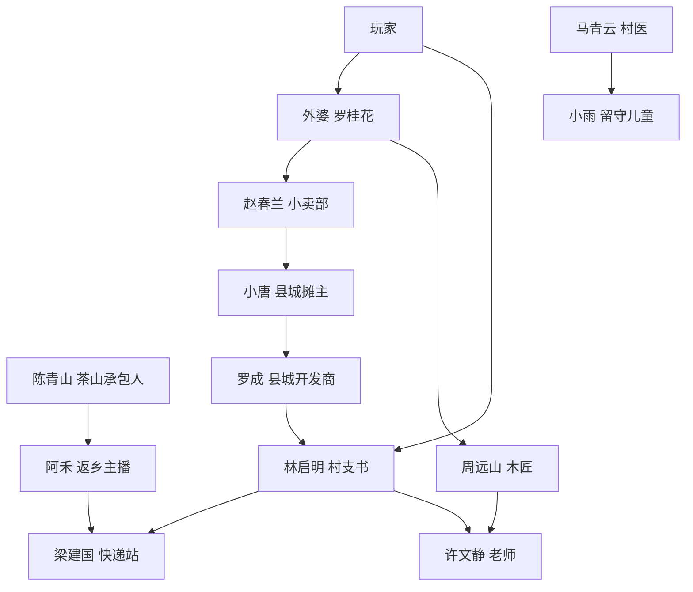

# NPC 关系表和首批 24 个核心 NPC 小传

## NPC 分层目标

首个完整版本建议先做 24 个核心 NPC。每个核心 NPC 都应具备身份、常驻地图、功能价值、礼物偏好、个人矛盾、好感事件和至少一条完整支线。

## 关系网络

## 首批 24 个核心 NPC

| npc_id | 姓名 | 身份 | 常驻地图 | 功能价值 | 最爱礼物 | 个人矛盾 | 人物线摘要 |
| --- | --- | --- | --- | --- | --- | --- | --- |
| npc_grandma_luo | 罗桂花 | 外婆 | 家屋/老院 | 新手教学、家庭主线 | 米糕、柿饼、旧照片 | 不愿承认身体变差 | 从照顾玩家变为接受玩家照顾，解开老院往事 |
| npc_secretary_lin | 林启明 | 村支书 | 村委会 | 村庄建设、主线 | 茶叶、修桥材料 | 公共利益和村民分歧 | 想振兴村子，但被资金、人情和开发压力夹住 |
| npc_store_zhao | 赵春兰 | 小卖部老板 | 供销社 | 种子、工具、消息 | 辣酱、花生糖 | 害怕老店被淘汰 | 从守旧小卖部转向新供销社 |
| npc_courier_liang | 梁建国 | 快递站老板 | 快递驿站 | 电商、发货、好友订单 | 茶礼盒、护膝 | 订单暴涨但人手不足 | 帮村里建立稳定物流链 |
| npc_carpenter_zhou | 周远山 | 老木匠 | 木匠铺 | 建筑、家具、摊位 | 好木材、米酒 | 手艺没人学 | 教玩家修屋，也面对自己被时代抛下 |
| npc_doctor_ma | 马青云 | 村医 | 卫生室 | 体力恢复、草药任务 | 蜂蜜、金银花 | 老人照护资源不足 | 推动卫生室升级和老人健康档案 |
| npc_streamer_ahe | 阿禾 | 返乡主播 | 老小学/快递站 | 电商、宣传、直播订单 | 草莓、漂亮礼盒 | 流量焦虑和乡亲误解 | 从追热点到做真实助农内容 |
| npc_teacher_xu | 许文静 | 老师 | 老小学 | 课程、儿童活动 | 旧课本、桂花茶 | 学校闲置和儿童陪伴问题 | 把老小学改造成活动中心 |
| npc_child_xiaoyu | 小雨 | 留守儿童 | 老小学/河堤 | 情感支线、探索提示 | 糖葫芦、竹蜻蜓 | 想念父母但不说 | 通过玩家陪伴重新变得开朗 |
| npc_tea_chen | 陈青山 | 茶山承包人 | 茶山 | 茶叶、山路解锁 | 好茶、竹篮 | 生态种茶和短期收益冲突 | 带玩家理解茶山和可持续经营 |
| npc_vendor_tang | 唐晓满 | 县城摊主 | 县城集市 | 摆摊教学、竞品 | 新鲜番茄、辣酱 | 竞争心强，不轻易认输 | 从竞争对手变成集市合作伙伴 |
| npc_boss_luo | 罗成 | 县城开发商 | 县城老街 | 商业冲突、后期选择 | 高级礼盒、玉石 | 想快速商业化村庄 | 不是纯反派，代表现实商业压力 |
| npc_fisher_han | 韩伯 | 老钓手 | 河堤/水库 | 钓鱼教学、鱼类图鉴 | 鲫鱼汤、好鱼竿 | 子女不理解他的坚持 | 解锁夜钓和水库故事 |
| npc_miner_wu | 吴三石 | 旧矿工 | 老矿洞 | 挖矿教学、矿洞安全 | 铁矿、米酒 | 对矿洞事故有阴影 | 帮玩家安全重开老矿洞 |
| npc_cook_qin | 秦阿姨 | 县城小吃摊主 | 夜市街 | 料理、夜市 | 河虾、辣椒 | 手艺好但摊位小 | 帮她做出夜市招牌菜 |
| npc_tailor_mei | 梅姐 | 裁缝 | 县城老街 | 服装、布艺装饰 | 棉布、花茶 | 县城手艺店客流少 | 解锁角色外观和摊位布棚 |
| npc_postman_yu | 余向前 | 老邮递员 | 村口/客运站 | 旧信件、地图拓展 | 旧邮票、茶水 | 见证村子人来人往 | 通过旧信串联村庄记忆 |
| npc_youth_guo | 郭小满 | 返乡修理工 | 修理铺 | 工具、机器维护 | 铁锭、烤红薯 | 城市失败后怕被笑话 | 从临时返乡到重新扎根 |
| npc_aunt_sun | 孙姨 | 广场舞队长 | 村口广场 | 活动、节日组织 | 花生糖、红围巾 | 爱管闲事但热心 | 帮她组织节庆和村民活动 |
| npc_farmer_he | 何大田 | 老农 | 稻田 | 农业技能、种植建议 | 水稻、菜籽油 | 不信年轻人会种地 | 从挑剔老师变成可靠后盾 |
| npc_beekeeper_lan | 蓝婆婆 | 养蜂人 | 后院果树区 | 蜂箱、花田 | 油菜花、蜂蜜 | 蜂群衰退 | 解锁蜂箱和花作物联动 |
| npc_inn_fang | 方岚 | 民宿经营者 | 河边民宿 | 旅客订单、装饰 | 柿饼、鲜花 | 担心村里接不住游客 | 推动适度旅游和村庄服务 |
| npc_accountant_deng | 邓会计 | 村会计 | 村委会 | 建设账目、数值说明 | 账本、绿茶 | 害怕公开账目引发矛盾 | 让村庄建设透明化 |
| npc_student_lin | 林小舟 | 县城高中生 | 客运站/老小学 | 年轻视角、学习任务 | 文具、草莓 | 想离开家乡又舍不得 | 与玩家讨论留下和离开 |

## NPC 关系表

| 关系 | NPC | 说明 | 可触发剧情 |
| --- | --- | --- | --- |
| 亲情 | 玩家、外婆 | 主线情感核心 | 老院旧物、外婆身体、年夜饭 |
| 村务合作 | 林书记、邓会计、赵春兰 | 公共建设三角 | 修桥、供销社改造、账目公开 |
| 物流电商 | 梁建国、阿禾、唐晓满 | 好友订单和县城交易 | 直播助农、快递爆仓、县城合作 |
| 手艺传承 | 周木匠、梅姐、郭小满 | 建筑、家具、外观 | 修屋、布棚、加工设备维护 |
| 儿童照护 | 许老师、马医生、小雨、林小舟 | 老小学和留守儿童线 | 活动中心、暑期课程 |
| 自然生产 | 何大田、陈青山、蓝婆婆、韩伯 | 种植、茶山、蜂箱、钓鱼 | 春耕、茶山路、蜂群恢复、水库夜钓 |
| 商业冲突 | 罗成、林书记、方岚、阿禾 | 开发和村庄复兴方向 | 民宿开发、县城资本、品牌选择 |

## 好感事件模板

| 好感 | 事件类型 | 内容要求 |
| ---: | --- | --- |
| 1 | 认识 | NPC 说明自己的功能和生活状态 |
| 2 | 日常帮助 | 提交少量物品，解锁小奖励 |
| 3 | 第一次个人困境 | 展示 NPC 的真实问题 |
| 4 | 功能奖励 | 解锁配方、折扣、地图或设备 |
| 5 | 关键选择 | 玩家需要在两种方案中选择 |
| 6 | 收束事件 | NPC 关系变化，给予专属装饰或技能 |

## 台词量建议

| NPC 层级 | 单人台词量 | 内容 |
| --- | ---: | --- |
| 核心 NPC | 250 到 500 句 | 四季、天气、好感、支线、节日 |
| 重点 NPC | 80 到 180 句 | 日常、商店、委托、少量支线 |
| 普通 NPC | 15 到 50 句 | 氛围、集市、节日 |
