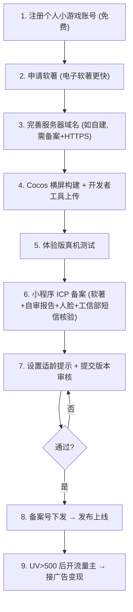

# 个人开发者上线清单（个人主体）

## 文档定位

`wechat-release-process.md` 是完整发布流程（含企业/版号/内购）。本文件是**个人主体、纯广告变现（IAA）、非棋牌/捕鱼/文化互动类**场景的**精简版上线清单**，覆盖软著申请、ICP 备案、流量主开通、个税等个人开发者关心的实操点。

> 适用前提：个人主体 + 广告变现（不开通虚拟支付）+ 非特殊类目。变现方案见 `monetization-iaa-solo-launch.md`。

## 个人主体能做什么（速查）

- ✅ 注册并发布小游戏；✅ 广告变现（流量主）；✅ 个人申请软著；✅ 个人 ICP 备案。
- ⚠️ 通常**不需要版号**（非棋牌/捕鱼/文化互动类）。
- ❌ **不能开通虚拟支付（内购）**；❌ 不能上架收费游戏。
- 需提交的资质只有：**软著 + 游戏自审自查报告**（+ ICP 备案）。

## 个人主体精简发布流程

## 1. 软著怎么申请

| 项 | 说明 |
| --- | --- |
| 受理机构 | 中国版权保护中心（纸质）；多平台支持**电子版权认证/电子软著**（更快更便宜） |
| 个人可否申请 | ✅ 个人可作为著作权人 |
| 周期 | 纸质软著约数周（近年审核趋严，偶有不下证）；电子软著更快 |
| 费用 | 自助申请基本免费/低费；代办约 500–1500 元 |
| 材料 | 软件基本信息、源代码（前后 60 页）、软件说明书/操作文档 |
| **名称一致** | **软著上的软件名称要与小游戏名称一致**（用全称时可忽略「游戏软件/V1.0」等后缀） |
| 备注 | 纸质软著适用于将来申请版号；上架用电子软著即可，两者可并存 |

> 提醒：游戏名不能带英文、不能纯数字（备案阶段会卡），软著和小游戏名提前对齐。

## 2. ICP 备案（小程序备案）步骤

2023 年底起强制，没备案无法发布。

1. MP 后台小程序首页点「去备案」。
2. 提交**主体信息**（个人身份证）、**负责人人脸核身**、**服务器域名信息**。
3. 平台初审（约 1–2 工作日），保持电话畅通以便核验。
4. 通过后，收到**工信部短信**，24 小时内到 [beian.miit.gov.cn](https://beian.miit.gov.cn) 完成**短信核验**。
5. 进入**通信管理局审核**（整体约 7–20 工作日）。
6. 下发**备案号**后即可进入发布流程（备案号上线后自动展示在资料页）。

## 3. 服务器域名（自建后端时）

- 本项目 `server/` 若对外提供服务，其域名需：**已 ICP 备案 + HTTPS/WSS**，并在 MP「开发设置-服务器域名」配置 `request/socket/uploadFile/downloadFile`。
- 早期想省事可用**微信云开发**（每月几十元起，免运维），等量大了再迁自建。

## 4. 账号与构建

- 个人主体注册**免费**（企业要 300/年认证费）。
- 完成**微信认证**后可获得被搜索、被分享能力（建议做，利于冷启动）。
- Cocos 构建为微信小游戏，**横屏**（deviceOrientation=landscape），主包达标 + 分包 + 远程资源（见 `client/README.md`、`wechat-release-process.md`）。
- 适龄提示提交审核前设置；玩法首图含「健康游戏忠告 + 适龄提示 + 游戏名称」。

## 5. 流量主开通（广告变现）

| 项 | 说明 |
| --- | --- |
| 开通条件 | 满足其一：累计独立访客 **UV > 500**；或同主体已有小游戏且连续一季度有广告收入。无严重违规 |
| 接入组件 | 激励视频、插屏等（广告设计见 `monetization-iaa-solo-launch.md`） |
| 发奖 | **服务端幂等**：广告失败不发奖、成功只发一次 |
| 结算 | 流量主后台查看收入与广告金 |

> 含义：**先得有量（UV>500）才能开广告位**，所以前期靠社交裂变/分享拉新很关键。

## 6. 个税与结算

- 个人主体广告收入，平台按规定**代扣个人所得税（约 20%）**。
- 提现/结算在流量主后台操作；留意每月广告金/激励金的有效期（多为 365 天，过期失效）。

## 7. 成本估算（个人起步）

| 项 | 估算 |
| --- | --- |
| 账号注册 | 0 元（个人主体免费） |
| 软著 | 0–1500 元（自助免费/低费，代办 500–1500） |
| 服务器 | 微信云开发几十元/月起；自建按量；DAU 上万后可能 2k–1w/月 |
| CDN | 资源托管按流量，几百元/月起 |
| 版号 | 个人 IAA 版**不需要** |
| 合计起步 | **几百到一两千元**即可上线（不含推广买量） |

## 8. 上线检查清单（可勾选）

资质：

- [ ] 个人小游戏账号注册 + 微信认证
- [ ] 软著证书（名称与小游戏名一致）
- [ ] 游戏自审自查报告（模板后台有，手写签名按指印）
- [ ] ICP 备案完成（含工信部短信核验、管局审核、备案号下发）
- [ ] 服务器域名已备案 + HTTPS/WSS（或改用微信云开发）
- [ ] 适龄提示已设置；玩法首图含「健康游戏忠告+适龄提示+游戏名称」

技术与体验：

- [ ] 横屏构建（deviceOrientation=landscape）、安全区适配
- [ ] 主包体积达标、分包 + 远程资源
- [ ] 登录/存档/经济服务端校验/集市/好友异步交易真机通过
- [ ] 断网/重连/重复点击/异常退出兜底
- [ ] 配置表无缺失/ID 重复/非法引用

变现（IAA）：

- [ ] 无内购、无付费墙；外观全部玩法/活动/积分解锁
- [ ] 激励视频自愿触发 + 每日上限 + 服务端幂等发奖
- [ ] 无 Banner 常驻、插屏只在自然停顿点限频
- [ ] UV>500 后开通流量主并接入广告
- [ ] 了解广告收入代扣 20% 个税

## 9. 现实提醒

- **最大难点不是技术，是流量/推广**——个人缺宣发渠道，要用足小满村的社交裂变（好友摊位、互买、群分享、回流钩子）。
- 玩法创意容易被抄，**先发优势 + 持续运营 + 社交关系链**才是护城河。
- 版号是未来做内购的硬门槛：想氪金化时，再走「注册个体户/公司 + 版号」或「找发行商联运分成」（见 `wechat-release-process.md`）。
- 可关注微信**首发/IAA 激励政策**（提审前在后台勾选申请，政策按年变动）。
