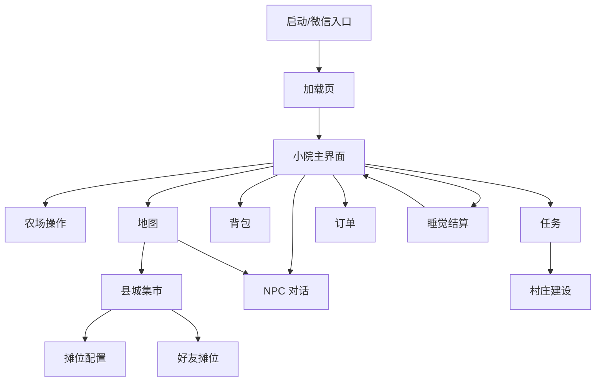
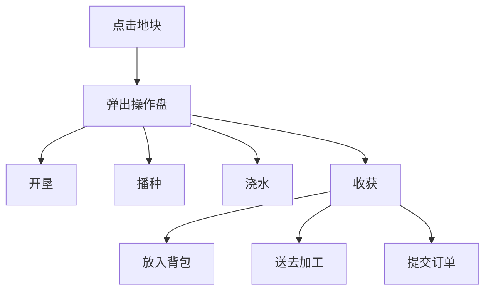
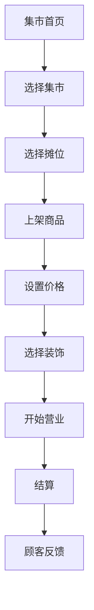
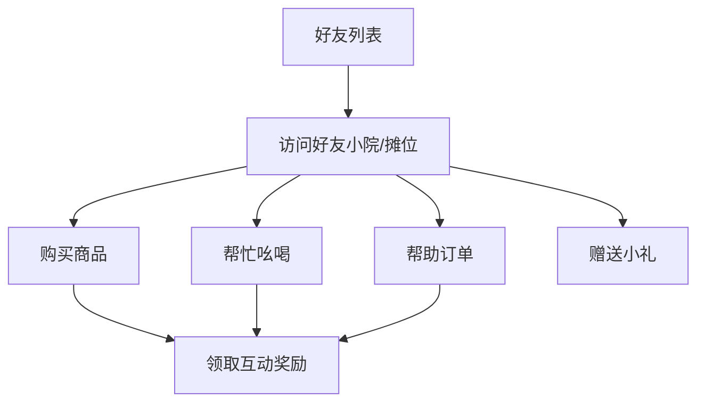

# 微信小游戏 UI 流程图

## UI 设计目标

《小满村》采用**横屏**微信小游戏。界面要在横屏下支持短时打开、快速收获、快速摆摊、好友互动和任务查看。主画面以舒展的场景为主体，HUD 与功能入口收在四周边角，避免压住地图；背包、订单、摊位上架等经营界面用横向分栏布局提高效率。

## 屏幕方向建议

**首发采用横屏（主方向），比例以 16:9 为主**，向更宽的全面屏（如 19.5:9）做安全区适配。竖屏不作为首发方向。

| 方向 | 优点 | 问题 | 结论 |
| --- | --- | --- | --- |
| 横屏 | 地图视野大，农场和集市场景舒展，沉浸式生活模拟体验好，家园/集市大场景展示和录屏分享更佳 | 单手操作弱、需双手横持；从微信竖持入口进来有横竖切换感 | **推荐首发主方向** |
| 竖屏 | 单手操作自然，适合碎片时间和微信社交入口 | 横向地图视野窄，场景表现受限 | 不作为首发方向 |
| 双适配 | 覆盖更多设备与场景 | 美术、UI、地图、测试成本明显增加 | 核心玩法稳定后再评估 |

### 横屏下的场景处理

- 地图采用 2.5D 俯视或轻 isometric 视角，横向卷动 + 缩放 + 镜头跟随。
- 小院、村口、集市按“横向铺开 + 局部纵向延展”设计，充分利用宽画幅。
- 重要交互点和操作盘就近弹出在点选对象附近，避免手指来回横跨长距离。
- 顶部条只放日期、天气、货币和体力，避免压住地图。
- 主功能入口收在屏幕一侧（建议左下或右下竖排），靠近拇指；右侧/边角留给订单、加工完成、活动等状态快捷。
- 大地图通过小地图、路牌和自动寻路降低迷路感。

### 横屏可用性注意

- 重要可点击元素避开左右两端的握持/安全区，留出边距。
- 关键操作尽量集中在屏幕下半部两侧拇指可达区域，中上部以展示为主。
- 适配刘海/灵动岛在横屏时位于左右一侧，UI 留安全区。
- 提供截图/家园分享模式，发挥横屏大场景的展示优势。

### 方向决策

本项目定位为**沉浸式返乡生活模拟**，农场、县城集市和大地图是核心体验载体，横屏能最大化场景表现力与代入感。微信社交、短时经营、好友摊位等优势通过自动寻路、批量操作、边角常驻 HUD 和快捷分享来保证效率，而不是靠竖屏单手操作。横竖双适配成本高，首发只做横屏一个主方向。

## 总流程

## 主导航（横屏侧边/边角）

横屏下主入口收在屏幕一侧竖排（建议左下角拇指可达区），不再使用竖屏的底部横排导航条。

| 入口 | 图标建议 | 功能 | 备注 |
| --- | --- | --- | --- |
| 小院 | 房子 | 回到主基地 | 默认首页 |
| 背包 | 背包 | 物品、图鉴、装备 | 高频 |
| 集市 | 摊位 | 普通赶集、夜市、好友摊位 | 核心特色 |
| 好友 | 双人 | 好友访问、吆喝、订单 | 微信社交 |
| 任务 | 清单 | 主线、日常、节日、村庄建设 | 红点提醒 |

## 小院主界面

| 区域 | 内容 | 交互 |
| --- | --- | --- |
| 顶部左侧 | 头像、等级、体力 | 点击进入角色信息 |
| 顶部中间 | 日期、时间、天气 | 点击打开日历 |
| 顶部右侧 | 现金、人情值、声望 | 点击查看资源说明 |
| 主画面 | 小院地图（横向铺开） | 点击地块、建筑、NPC |
| 右侧快捷 | 订单、加工完成、活动 | 有状态时显示 |
| 侧边导航 | 小院、背包、集市、好友、任务 | 一侧竖排常驻（拇指可达） |

## 农场操作流程

## 背包界面

| 标签 | 内容 | 功能 |
| --- | --- | --- |
| 全部 | 所有可携带物品 | 排序、出售、丢弃 |
| 作物 | 蔬菜、水果、粮食 | 查看品质和保鲜 |
| 水产 | 鱼、虾、养殖品 | 图鉴入口 |
| 材料 | 木材、矿石、竹材 | 建造和升级 |
| 加工品 | 腌菜、茶、礼盒 | 上架集市 |
| 任务 | 剧情物品 | 不可误售 |

## 集市流程

## 摊位配置界面

| 区域 | 内容 | 说明 |
| --- | --- | --- |
| 顶部 | 集市名称、天气、预计客流 | 帮助玩家判断备货 |
| 左侧 | 摊位预览 | 展示装饰和商品 |
| 右侧 | 上架栏 | 货位数量随等级提高 |
| 下方 | 背包商品 | 可筛选可售物品 |
| 价格弹窗 | 建议价、调价、预计成交率 | 避免玩家盲目定价 |
| 开摊按钮 | 开始营业 | 二次确认高价值商品 |

## 好友互动流程

## 任务界面

| 标签 | 内容 | 排序 |
| --- | --- | --- |
| 主线 | 推进系统和剧情 | 强制置顶 |
| 村民 | NPC 支线 | 按好感和距离 |
| 日常 | 当日委托 | 按过期时间 |
| 集市 | 摆摊和订单 | 按集市开放时间 |
| 村庄 | 公共建设 | 按资源缺口 |
| 节日 | 限时任务 | 强红点提醒 |

## 睡觉结算

| 模块 | 展示内容 |
| --- | --- |
| 农场 | 作物成长、动物产出 |
| 加工 | 完成的加工品 |
| 集市 | 摊位销售额、剩余商品、顾客反馈 |
| 好友 | 购买、吆喝、订单帮助 |
| 关系 | NPC 好感变化 |
| 解锁 | 新配方、新地图、新任务 |

## 新手前 10 分钟 UI 路径

1. 启动进入小院。
2. 与外婆对话。
3. 点击杂草清理。
4. 点击地块开垦。
5. 点击种子播种。
6. 点击水壶浇水。
7. 打开任务查看下一步。
8. 前往村口和供销社。
9. 返回睡觉结算。
10. 次日看到作物成长反馈。

## 移动端可用性要求

- 主要按钮高度不小于 44px。
- 侧边/边角主导航最多 5 个主入口，靠拇指可达侧布置。
- 可点击元素避开横屏左右两端的握持区与刘海/灵动岛安全区。
- 同屏弹窗不超过两层。
- 背包格子需要支持长按查看详情。
- 摊位上架支持一键补货和批量下架。
- 对话文本每屏控制在 35 个汉字以内，重要剧情可分页。
- 红点只提示有价值的变化，避免全屏红点疲劳。
