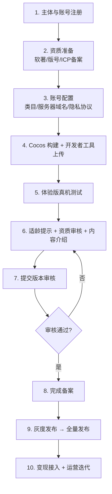

# 微信小游戏发布流程（小满村）

## 文档定位

梳理《小满村》从开发完成到正式上线微信小游戏的**完整发布流程**：资质、备案、配置、构建、测试、审核、发布、变现与合规。配合 `tech-data-qa.md` 的「发布前检查」和 `mvp-milestones-and-staffing.md` 的 M5（打磨/灰度）。

> 政策以 2026 年微信官方文档为准，具体材料和时效以 [微信公众平台](https://mp.weixin.qq.com) 和 [微信开放文档](https://developers.weixin.qq.com/minigame/introduction/) 最新页面为准。

## 关键前提：先确定变现形态

发布路径取决于是否开通**虚拟支付（内购 IAP）**，这决定备案通道、所需资质和时效：

| 形态 | 是否需要版号 | 备案通道 | 备案到发布时效（约） |
| --- | --- | --- | --- |
| **带内购（IAP）** | **必须版号** | 情况一：开通虚拟支付 | 5–12 个工作日（资质过审后） |
| **纯广告变现（IAA，无内购）** | 通常不强制版号 | 情况二：不开通虚拟支付 | 资质审核 1–2 个工作日 |
| 版号游戏完整前置审批 | 需版号 | 前置审批（适龄+资质+内容介绍） | 10–30 个工作日 |

> 《小满村》设计含内购、月卡和广告（见 `monetization-and-liveops.md`）。若首发就上内购，按**情况一（需版号）**准备；若想先用纯广告 IAA 快速上线、后续再补版号开内购，可先走**情况二**。建议：版号办理周期长，**尽早立项申请版号**，不要等到要上内购才办。

## 总体流程

## 1. 主体与账号注册

- 在 [微信公众平台](https://mp.weixin.qq.com) 注册**小游戏**账号（一级类目「游戏」在注册时勾选，**之后不可更换**）。
- **主体建议为企业**：个人主体限制多，且**虚拟支付/版号基本要求企业主体**。
- 完成微信认证。
- 拿到 **AppID**（客户端构建和登录都要用）。

## 2. 资质准备（最耗时，尽早启动）

| 资质 | 说明 | 备注 |
| --- | --- | --- |
| **计算机软件著作权（软著）** | 证明原创，必需 | 软著上的游戏名称需与小游戏名称一致；著作权人需与版号一致 |
| **网络游戏出版物号（版号）** | 带内购必需 | 周期长（数月起），**最早启动** |
| **ICP 备案（小程序备案）** | 2023 年底起强制 | 提交主体信息、负责人人脸核身、域名信息；约 7–20 工作日 |
| 运营/著作权授权书 | 如使用他人 IP、商标、美术、音乐、文学作品 | 按系统提示补充 |
| 游戏自审自查报告 | 内容合规自查 | — |

> 名称一致性是高频驳回点：**小游戏名称、软著名称、版号名称、账号主体**要保持一致，中途改名/迁移主体会导致备案驳回。

## 3. 账号与开发配置

- **二级类目**：发布前可改（如休闲/模拟经营），发布后不可改；三级类目可在资质管理改。
- **服务器域名**：在 MP 后台配置 `request / socket / uploadFile / downloadFile` 合法域名。
  - 必须 **HTTPS / WSS**，且**域名已 ICP 备案**。
  - 对应本项目 `server/` 的对外域名（如 `https://api.xiaomancun.com`），需提前备案并配好证书。
- **用户隐私保护指引**：在 MP 填写隐私协议，客户端接入隐私授权接口（`wx.getPrivacySetting` / `wx.requirePrivacyAuthorize` 等），否则相关接口会被拦截。
- **适龄提示**：提交前必须设置（如「适龄 8+/12+/16+」）。

## 4. 构建与上传

### Cocos Creator 构建（横屏）

- 构建平台选 **微信小游戏**，填入 AppID。
- **Device Orientation 设为 Landscape**（横屏，写入 `game.json` 的 `deviceOrientation: "landscape"`，见 `client/README.md`）。
- **分包优化**：主包控制在限制内（约 4MB），首屏只放新手村+开场所需资源，其余走**远程资源加载**（AssetBundle + CDN）。
- 压缩纹理、裁剪引擎模块、按需 WASM。

### 上传

1. 用**微信开发者工具**打开 Cocos 构建产物目录。
2. 真机预览确认无误。
3. 点「上传」，填**版本号**和**项目备注** → 进入 MP 后台「版本管理-开发版本」。

## 5. 测试（提审前）

- 生成**体验版**二维码，添加**体验成员**测试。
- 真机覆盖：不同屏幕比例、横屏安全区（刘海/灵动岛在左右侧）、低端机帧率、弱网/断网/重连。
- 跑通 `tech-data-qa.md` 的 QA 范围与「发布前检查」表。
- 确认登录、存档、经济服务端校验、集市、好友异步交易在真机正常（联调 `server/`）。

## 6. 前置审批三件套（版号游戏）

路径：MP 首页 →「小程序备案」→ 小游戏备案&发布流程指引。三项提交不分先后，但**都要完成**才能递交主管部门：

1. **适龄提示**：提交前设置好并等待审核（约 1 工作日）。
2. **资质提交**：选三级类目、是否同时申请支付资质，上传版号/软著/授权书（材料勿错位上传，否则驳回）。
3. **游戏内容介绍**：真实描述场景/玩法/功能 + 截图。**玩法首图必须含「健康游戏忠告 + 适龄提示 + 游戏名称」三要素**，截图尺寸/版本一致。

> 除棋牌/文化互动类外，**资质审核与版本审核可并行**（资质提交后无需等结果即可提交版本审核）。版号游戏需资质审核通过后，再接入中宣部实名认证系统。

## 7. 提交版本审核

- 「版本管理-开发版本」→「提交审核」。
- 填写完整版本信息、配置项；常规更新审核约 2–4 小时，新游首发约 1–2 工作日（已引入 AI 辅助审核）。
- 被驳回则按反馈整改后重新提交。

## 8. 完成备案 + 发布

- **发布前必须完成版本审核 + 备案**。
- 审核通过且备案完成后，可在版本管理点击发布。
- **灰度发布**：先按比例放量（对应 M5——先开前 7 天内容 + 普通赶集），观察新手漏斗、经济产出、卡点、崩溃率，再全量。

## 9. 变现接入

### 流量主（广告）

- 开通条件（满足其一）：小游戏累计独立访客 **UV > 500**；或同主体名下已有小游戏且连续一季度有广告收入。无严重违规记录。
- 开通后接入激励视频、插屏等广告组件。
- **服务端幂等发奖**（见 `tech-data-qa.md` 反作弊），广告失败不发奖、成功只发一次。

### 虚拟支付（内购）

- 需企业主体 + 版号 + 签署虚拟支付协议。
- **接入中宣部实名认证系统**：开通虚拟支付的游戏必须自行在中宣部系统完成企业注册、添加游戏、渠道绑定（渠道商绑定深圳市腾讯计算机系统有限公司），并把游戏名、版号、备案识别码同步到 MP。
- 注意 iOS 与安卓虚拟支付政策差异与分成。

### 激励政策（可关注，按年变动）

- 2026 IAA：注册用户「首 30 天激励 40%」或「首 90 天激励 35%」可选；>45 天回流用户视同注册享激励。
- 2026 IAP：首发新游激励金等（多以「广告金」形式发放，仅限腾讯广告体系投放，约 365 天有效期）。
- 刷量/诱导分享等违规会被取消资格或回收广告金。

## 10. 防沉迷与合规

- **实名/防沉迷**：所有小游戏已统一接入腾讯健康系统（对接中宣部实名系统）。**不开通虚拟支付**则平台统一协助接入，开发者无需额外操作；**开通虚拟支付**则需自行完成中宣部系统接入（见上）。
- 未成年人时段与消费限制按平台标准实现，游戏内含防沉迷提示。
- 内容合规：敏感词、台词、伪文字、广告与隐私合规（对应 `tech-data-qa.md` 发布前检查的「内容/合规」）。

## 11. 上线后：运营与迭代

- **热更新**：小游戏代码包更新——用户下次进入加载新版本；远程资源（活动/美术）走 CDN 即时更新。
- 数据：MP 数据助手 + 自建埋点数仓（新手漏斗/经济/留存/社交）。
- 性能：持续盯首屏加载、内存、低端机帧率。
- 版本迭代仍需走审核（常规更新审核较快）。

## 12. 时间预估（粗略）

| 阶段 | 预估周期 |
| --- | --- |
| 软著办理 | 1–4 周（电子认证更快） |
| 版号办理 | 数月（带内购必备，**最早启动**） |
| ICP 备案 | 7–20 工作日 |
| 资质审核 | 1–3 自然日 |
| 前置审批到发布（版号游戏） | 10–30 工作日 |
| 备案到发布（不开通虚拟支付） | 5–12 工作日 |
| 版本审核（首发） | 1–2 工作日 |

> 关键路径是**版号**。若首发带内购，发布时间基本由版号决定，务必提前规划。

## 13. 小满村发布检查清单

资质与合规：

- [ ] 企业主体注册 + 微信认证完成
- [ ] 软著证书（名称与小游戏名一致）
- [ ] 版号（带内购必需，著作权人与软著一致）
- [ ] ICP 备案完成，`server/` 域名已备案 + HTTPS/WSS
- [ ] 适龄提示已设置
- [ ] 用户隐私保护指引填写 + 客户端隐私授权接口接入
- [ ] 玩法首图含「健康游戏忠告 + 适龄提示 + 游戏名称」

技术与体验（对接 `tech-data-qa.md` 发布前检查）：

- [ ] 横屏构建正确（deviceOrientation=landscape），安全区适配
- [ ] 主包体积达标，分包 + 远程资源加载
- [ ] 首屏加载、地图切换、低端机帧率达标
- [ ] 登录/存档/经济服务端校验/集市/好友异步交易真机通过
- [ ] 断网、重连、重复点击、异常退出有兜底
- [ ] 配置表无缺失/ID 重复/非法引用
- [ ] 经济产出与消耗闭环，无明显刷收益漏洞

变现与运营：

- [ ] 流量主开通条件达成（UV>500）后接入广告，服务端幂等发奖
- [ ] 内购走虚拟支付协议 + 中宣部实名接入 + 平台订单校验
- [ ] 埋点接入数仓，灰度监控看板就绪
- [ ] 灰度方案：先前 7 天内容 + 普通赶集，再全量
